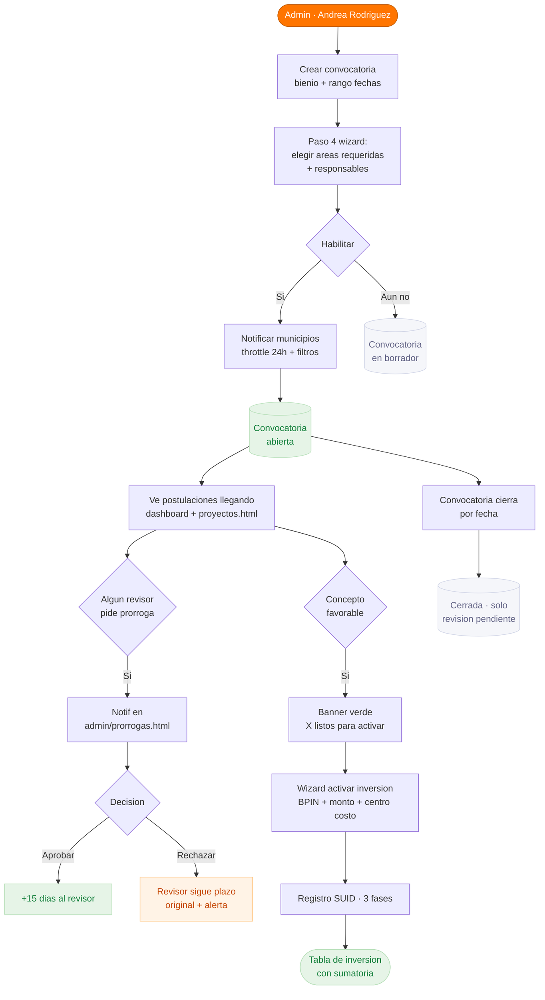
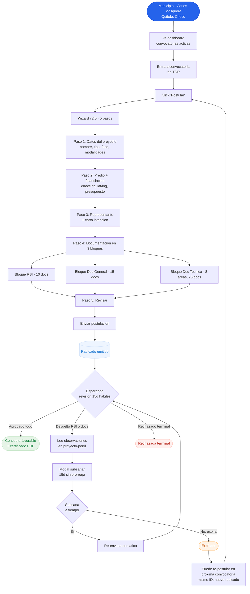
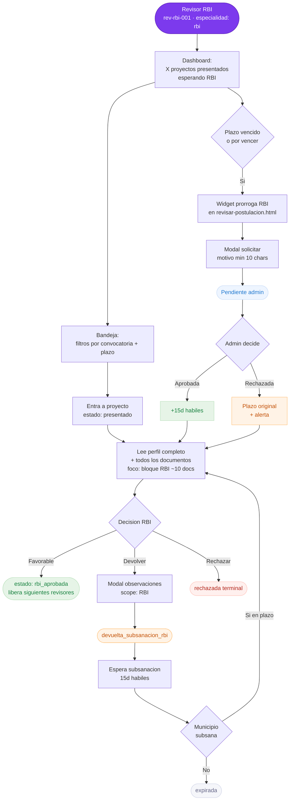
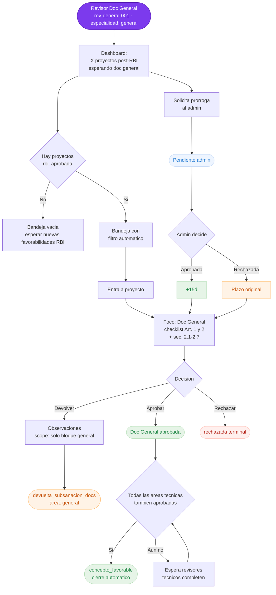
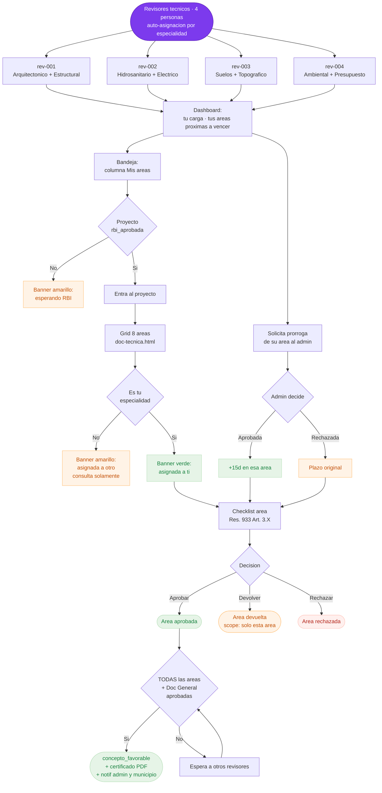
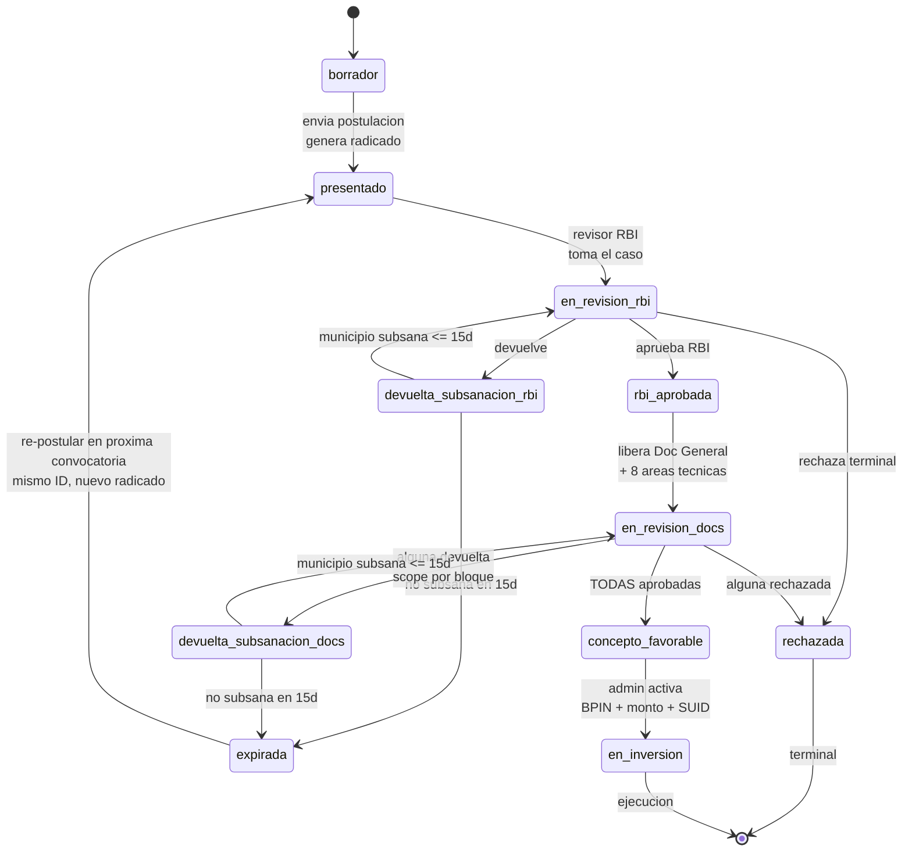

# Project v2.0 — Flujos por rol para validación con stakeholders

> **Estado:** Propuesta de modelo · pendiente de validación con Andrea Rodríguez, Danna Arrieta y Juan Manuel Armero.
> **Fecha:** 14 de mayo de 2026
> **Origen:** Acta de la llamada del 13/05/2026 (Danna + Juanma) + nuevo documento normativo `Lista-chequeo-Resolucion-933-de-2024-v2.xlsx`.
> **No implementar nada del código todavía** — primero recibir feedback sobre los diagramas.

---

## 1 · Resumen v1.0 → v2.0

| Aspecto | v1.0 (congelada en `naowee-tech/naowee-test-project`) | v2.0 (propuesta) |
|---|---|---|
| Wizard postular | 6 pasos · arranca con "Entidad formuladora" | **5 pasos · sin entidad formuladora** (se hereda del perfil municipio) |
| Carga de documentos | 1 paso final con 9 áreas mezcladas | **3 bloques diferenciados**: RBI · Doc General · Doc Técnica |
| Revisor RBI | Cualquier revisor del pool decide RBI | **Rol dedicado** `rev-rbi-001` con scope explícito |
| Revisor Doc General | rev-005 lo hace pero sin scope explícito | **Rol dedicado** `rev-general-001` |
| Revisores técnicos | 4 especialistas, ven RBI también | 4 especialistas, **bloqueados hasta que RBI esté aprobado** |
| Orden de revisión | RBI → todo en paralelo (general + áreas) | **RBI → (Doc General + 8 áreas en paralelo)** — orden secuencial |
| Prórroga | RBI puede pedir, admin aprueba | **Cualquier revisor** puede pedir (RBI, general, técnico) — admin aprueba |
| Subsanación municipio | 15 días hábiles, no prorrogable, expira | Igual (sin cambio) |

**El cambio central:** el municipio carga TODA la documentación al postular, pero la revisión es **secuencial y por capas**.

---

## 2 · TO DO list priorizado

Extraído del acta del 13/05/2026 (Danna + Juanma):

| # | P | Tema | Cita / origen | Estado en v1.0 |
|---|---|---|---|---|
| 1 | **P0** | Subir RBI + Doc General + Doc Técnica en **3 bloques diferenciados** al postular | Danna: *"se dividió la parte de requisitos básicos indispensables, que son unos temas, y la revisión técnica sectorial, que son otros"* | Hoy es 1 bloque con 9 áreas mezcladas |
| 2 | **P0** | Quitar paso "Entidad formuladora" del wizard | Doug + Danna (acordado verbalmente) | Existe como paso 1 |
| 3 | **P0** | Crear rol **Revisor RBI** dedicado | Danna: *"Juan Manuel es revisor de requisitos básicos indispensables"* | Cualquier revisor decide RBI |
| 4 | **P0** | Crear rol **Revisor Doc General** dedicado | Danna: *"rol revisor, revisor de documentación general"* | rev-005 hace doc general pero sin scope explícito |
| 5 | **P0** | Orden de revisión secuencial: **RBI → (Doc General + 8 áreas en paralelo)** | Danna: *"orden orden orden de las revisiones"* | RBI → etapa documental con todo simultáneo |
| 6 | **P0** | Prórroga **sólo para revisores**, no para municipio | Danna + Juanma: *"prórroga para revisión, no prórroga para subsanación"* | v1.0 ya tiene prórroga revisor RBI; falta extenderla a general y técnicos |
| 7 | **P1** | Justificación de cambios en cada subsanación (trazabilidad) | Danna: *"ahí eso me falta"* (acta) | Hoy hay textarea, falta marcarla como required ≥20 chars |
| 8 | **P1** | Expiración automática 15 días tras devolución | Acta | Existe `sla-expiry.js`, validar que aplique a subsanación |
| 9 | **P1** | Re-postulación: mismo `idUnico` + nuevo `radicado` en próxima convocatoria | Doug: *"escenario subsanación fuera de plazo"* | No implementado |
| 10 | **P1** | Notificación a municipios cuando se selecciona departamento (cascada) | Juanma | Hoy es lista explícita de municipios |
| 11 | **P2** | Validar copy y campos del xlsx v2 vs los 9 bloques actuales | Diff Excel viejo vs v2 | Necesita pasada de QA del xlsx |
| 12 | **P2** | Variants: Construcción nueva / Mejoramiento / Adecuación / Dotación cambian documentos requeridos | Acta 13/05 (Juanma) | Hoy todos los tipos piden lo mismo |

**Aristas abiertas** (no implementar, **preguntar a stakeholders en la validación**):

- ¿Cuántos proyectos puede postular un municipio por convocatoria?
- Si se expira un proyecto pero la convocatoria sigue abierta, ¿puede crear otro nuevo distinto? (acuerdo tentativo: sí, pero NO el mismo)
- ¿Plantillas de notificación editables o fijas en v2.0? (Juanma: implica refactor backend, posponer)
- ¿La prórroga del revisor de Doc General y de los técnicos es independiente por persona, o solo una por proyecto?
- Si se devuelve solo una área técnica, ¿el municipio reabre el wizard completo o solo el bloque de esa área?

---

## 3 · Modelo de datos propuesto

### 3.1 · Estados del proyecto (v2.0)

```
borrador
  → presentado (envío + radicado)
    → en_revision_rbi
      → rbi_aprobada (RBI ok)
        → en_revision_docs  (Doc General + 8 áreas en paralelo)
          → concepto_favorable (todas ok)
            → en_inversion (admin activa)
          → devuelta_subsanacion_docs (alguna devuelta)
            → en_revision_docs (municipio subsana)
            → expirada (no subsana en 15d)
      → devuelta_subsanacion_rbi
        → en_revision_rbi (municipio subsana)
        → expirada (no subsana en 15d)
      → rechazada (terminal)
  → expirada → presentado (re-postulación, mismo idUnico, nuevo radicado)
```

### 3.2 · Pool de revisores ampliado

| ID | Nombre | Especialidades | Scope |
|---|---|---|---|
| `rev-rbi-001` | (nuevo, asignar) | `rbi` | Bloque 1 — Requisitos Básicos Indispensables |
| `rev-general-001` | Luis Felipe Rondón (renombrado de `rev-005`) | `general` | Bloque 2 — Documentación general (Art. 1 y 2 + sec. 2.1–2.7) |
| `rev-001` | Juan Manuel Ávila | `arquitectonico`, `estructural` | Áreas 3.3 y 3.4 del Bloque 3 |
| `rev-002` | María Elena Cortés | `hidrosanitario`, `electrico` | Áreas 3.5 y 3.6 |
| `rev-003` | Carlos Beltrán | `suelos`, `topografico` | Áreas 3.1 y 3.2 |
| `rev-004` | Andrea Quintero | `ambiental`, `presupuesto` | Áreas 3.7 y 3.8 |

**Total:** 6 revisores (2 nuevos roles + 4 especialistas existentes).

### 3.3 · Estructura de documentación por bloque

| Bloque | Sección | # docs aprox. | Quién revisa |
|---|---|---|---|
| **1 · RBI** | Carta intención, titularidad predio, info geográfica básica | ~10 | rev-rbi-001 |
| **2 · Doc General** | Análisis necesidad, sostenibilidad, licencias, servicios públicos | ~15 | rev-general-001 |
| **3 · Doc Técnica** | Topográfico, suelos, arquitectónico, estructural, hidrosanitario, eléctrico, ambiental, presupuesto | ~25 en 8 áreas | rev-001 a rev-004 (auto-asignación por especialidad) |

---

## 4 · Diagrama 1 — Administrador de Convocatoria (Ministerio)

**Perfil:** Andrea Rodríguez · Recursos y Herramientas del Ministerio del Deporte.



### Caminos alternos del admin

1. **Rechaza prórroga** → revisor sigue con plazo original, recibe alerta.
2. **Convocatoria cierra por fecha** → estado `cerrada`, no acepta nuevas postulaciones pero sigue procesando las existentes.
3. **Cancela convocatoria** (no en happy path) → estado terminal `cancelada`, todas las postulaciones quedan suspendidas.

---

## 5 · Diagrama 2 — Municipio / Ente Territorial

**Perfil:** Carlos Mosquera Rentería · Secretario de Planeación de Quibdó (Chocó). Otros perfiles válidos: Alcaldía Distrital, Gobernación Departamental, Resguardo Indígena, Consejo Comunitario Afrodescendiente.



### Caminos alternos del municipio

1. **Devolución a subsanación** (RBI o algún bloque de docs) → 15 días hábiles, NO prorrogable → si no responde, expira.
2. **Expiración** → puede re-postular en la **próxima convocatoria** preservando el `idUnico` (radicado nuevo, indica continuidad para auditoría).
3. **Rechazo terminal** → no puede re-postular este mismo proyecto; puede crear uno nuevo con id distinto.

---

## 6 · Diagrama 3 — Revisor RBI

**Perfil:** `rev-rbi-001` · revisor dedicado a Requisitos Básicos Indispensables. Hoy en v1.0 no existe como perfil distinto — se crea en v2.0.



### Caminos alternos del revisor RBI

1. **Solicita prórroga** (15 días extra, una sola vez por proyecto) → admin aprueba o rechaza.
2. **Devuelve a subsanación** → si el municipio no responde en 15d, el proyecto **expira automáticamente** (sla-expiry).
3. **Rechaza terminal** → cierra el flujo; el municipio puede crear otro proyecto distinto pero no re-postular el mismo.

---

## 7 · Diagrama 4 — Revisor Documentación General

**Perfil:** `rev-general-001` · revisor dedicado a la documentación general (Art. 1 y 2 Res. 933 + secciones 2.1–2.7 del nuevo xlsx). Es el reemplazo explícito de `rev-005` Luis Felipe Rondón.



### Caminos alternos del revisor Doc General

1. **Solicita prórroga** → mismo mecanismo que RBI.
2. **Devuelve a subsanación con scope `general`** → municipio corrige solo ese bloque (no toca los anexos técnicos que ya están aprobados o pendientes en otra fila).
3. **Espera a que todas las áreas técnicas terminen** → si las suyas están aprobadas pero falta alguna técnica, se queda en pausa hasta que cierre el concepto.

---

## 8 · Diagrama 5 — Revisores Técnicos por Área

**Perfil:** 4 especialistas existentes (`rev-001` a `rev-004`). Cada uno revisa SOLO las áreas de sus especialidades. La auto-asignación por especialidad ya existe en v1.0.



### Caminos alternos de los revisores técnicos

1. **Solicita prórroga de su área** → independiente por revisor (no afecta a los otros especialistas del mismo proyecto).
2. **Devuelve a subsanación con scope `topografico` / `suelos` / etc.** → municipio solo corrige esa área; las otras siguen su flujo.
3. **Admin reasigna el área** a otro especialista (caso enfermedad/saturación) — pendiente confirmar UX exacto del flujo de reasignación.

---

## 9 · Diagrama transversal — Estados del proyecto



---

## 10 · Aristas abiertas para los stakeholders

Estas preguntas **no están resueltas en el acta del 13/05/2026** y deben confirmarse antes de implementar v2.0:

| # | Pregunta | Quién responde |
|---|---|---|
| 1 | ¿Cuántos proyectos puede postular un municipio por convocatoria? | Danna + Andrea |
| 2 | Si un proyecto expira (subsanación vencida) pero la convocatoria sigue abierta, ¿puede crear otro proyecto distinto en la misma convocatoria? | Danna |
| 3 | La prórroga del revisor Doc General y de los técnicos, ¿es independiente por revisor o solo una por proyecto? | Juanma (consecuencias técnicas) |
| 4 | Si se devuelve solo un área técnica, ¿el municipio reabre el wizard completo o solo el bloque de esa área? | Doug + Danna (UX) |
| 5 | ¿Cuándo se notifica al revisor de Doc General y a los técnicos? ¿Al instante de aprobarse el RBI o cuando entran al sistema? | Juanma |
| 6 | ¿El admin puede reasignar un área a otro especialista? ¿Y la cuenta de prórroga se resetea con la reasignación? | Andrea |
| 7 | ¿Plantillas de notificación editables en v2.0 o queda para v3.0? | Juanma (backend) |
| 8 | Variants por tipo de solicitud (Construcción / Mejoramiento / Adecuación / Dotación) cambian la lista de documentos requeridos. ¿Aplica en v2.0 o se posterga? | Danna |

---

## 11 · Checklist de validación

Para cada stakeholder, marcar **OK** o anotar cambios:

### Andrea Rodríguez · Admin de convocatorias

- [ ] Diagrama 1 (Admin) refleja correctamente mi flujo diario.
- [ ] El panel de prórrogas (`admin/prorrogas.html` ya existe en v1.0) sigue siendo el mismo en v2.0 pero ahora recibe solicitudes de los 3 tipos de revisor.
- [ ] Activar inversión + Registro SUID **no cambia respecto a v1.0**.

### Danna Arrieta · Producto / normativa

- [ ] Diagrama 2 (Municipio) muestra los 3 bloques de documentos como esperabas.
- [ ] El paso "Entidad formuladora" queda eliminado del wizard.
- [ ] El orden secuencial RBI → (Doc General + Áreas) está correctamente reflejado.
- [ ] La re-postulación con `idUnico` preservado pero radicado nuevo es lo correcto.

### Juan Manuel Armero · Tech lead

- [ ] Los nuevos roles `rev-rbi-001` y `rev-general-001` son aceptables para el modelo de datos.
- [ ] La prórroga extendida a los 3 tipos de revisor es viable técnicamente.
- [ ] El estado `en_revision_docs` con sub-estados por área (general + 8 técnicas en paralelo) es manejable.
- [ ] La auto-asignación por especialidad sigue el patrón actual.

---

## 12 · Próximos pasos (post-validación)

Cuando los 3 stakeholders firmen este documento:

1. Crear repo `naowee-tech/naowee-test-project-v2` (clonado de `naowee-test-project` v1.0.0).
2. Generar un plan de implementación detallado en otro archivo.
3. Construir v2.0 sin tocar v1.0 (queda como referencia histórica).
4. Iterar con feedback de Andrea/Danna/Juanma.
